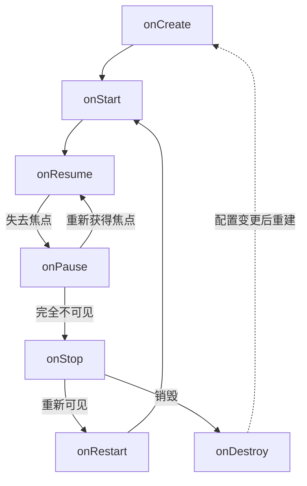

> 生命周期是系统在 Activity 状态变化时回调的一组方法。重点不是背顺序，而是搞清三件事：
> **每个回调对应什么状态**、**这个时机能做什么 / 不能做什么**、**哪个回调并不保证被调用**。

## 1. 状态转换全景


### 四种状态

| 状态 | 对应回调 | 实例存活 | 可见 | 可交互 |
| --- | --- | --- | --- | --- |
| Resumed（运行） | `onResume` | ✅ | ✅ | ✅ |
| Paused（暂停） | `onPause` | ✅ | 可能部分可见 | ❌ |
| Stopped（停止） | `onStop` | ✅ | ❌ | ❌ |
| Destroyed（销毁） | `onDestroy` | ❌ | ❌ | ❌ |

两个容易记错的点：

- **Paused 不等于可见**：A 跳转到全屏的 B 后，A 会先处于 Paused（此时已被遮挡），B 完全展示后才回调 `onStop`。
- **Stopped 不等于销毁**：实例还在内存里，但进程已经是后台进程，**随时可能被系统直接杀死，且不会再有任何回调**。

## 2. 七个回调

### onCreate
- **调用次数**：每次创建实例调用一次；配置变更重建时会再次调用
- **参数**：`savedInstanceState != null` 说明这是**重建**（转屏 / 进程被杀后恢复），而不是首次启动
- **能做**：`setContentView()`、初始化 ViewModel 与数据绑定、读取 `savedInstanceState`、初始化只该做一次的东西
- **别做**：耗时 IO —— 它跑在首帧之前，直接拖慢冷启动
- **注意**：此时 View 还没测量，`getWidth()` 必然是 0；首次 measure/layout/draw 发生在 `onResume` 之后

### onStart
- Activity **变为可见**，但还没有焦点、不能交互；与 `onStop` 配对
- 适合注册 / 注销"只在可见时才有意义"的监听（广播、`ContentObserver`、定位回调）
- 从后台回来时会先走 `onRestart` 再进来

### onResume
- 位于栈顶、**获得焦点、可交互**；与 `onPause` 配对
- 适合：启动动画、注册传感器、恢复相机预览、播放视频等**独占型资源**
- **注意**：`onResume` 返回后才真正绘制首帧，这里的耗时操作一样会拖慢启动速度

### onPause
- 第一个"正在离开前台"的回调，此时 Activity **仍然可见**
- **必须尽快返回**：A 跳 B 时，B 的 `onResume` 要等 A 的 `onPause` 执行完，卡在这里用户就会感觉"点了没反应"
- 适合：停止动画、释放独占资源（相机、传感器）、轻量的数据落地
- 别做：耗时 IO / 网络请求 / 批量数据库写入
- 此时弹 Dialog / Toast 有风险：窗口 token 可能已失效，抛 `WindowManager$BadTokenException`

### onStop
- Activity **完全不可见**；与 `onStart` 配对
- **危险区**：`onStop` 之后进程随时可能被杀，所以"必须保存"的数据不要拖到 `onDestroy`
- 适合：注销监听、停止定时器 / 动画、较重但必要的持久化
- 此时再提示用户已经没有意义（界面看不见）

### onRestart
- 从 Stopped 回到前台时调用，紧接 `onStart`
- 只有 **onStop → 重新可见** 才会经过它；`onPause → onResume` 不会

### onDestroy
- 销毁前的最后一个回调，之后实例即可被回收
- **区分销毁原因**：`isFinishing() == true` 是主动结束（返回键 / `finish()`）；`isFinishing() == false` 是配置变更，随后会重建
- **不保证被调用**：进程被系统杀死时不会走 `onDestroy`，所以关键释放逻辑不能只放这里

## 3. 常见场景的回调顺序

### 首次启动
```text
onCreate → onStart → onResume
```

### A 启动 B（B 全屏不透明）
```text
A.onPause → B.onCreate → B.onStart → B.onResume → A.onStop
```
A 的 `onStop` 在 B 完全展示之后才执行，所以 A 会短暂停留在 Paused —— 这是正常现象，不是卡顿。

### B 返回 A
```text
B.onPause → A.onRestart → A.onStart → A.onResume → B.onStop → B.onDestroy
```

### B 是 Dialog / 透明主题的 Activity
```text
A.onPause → B.onCreate → B.onStart → B.onResume     # A 只 Pause，不 Stop（A 仍然可见）
B.onPause → A.onResume → B.onStop → B.onDestroy
```

### 按 Home 键 / 切到其他 App
`onPause → onStop`（实例还在内存里，没有销毁）；回来时 `onRestart → onStart → onResume`。

### 锁屏 / 息屏
`onPause → onStop`；解锁后 `onRestart → onStart → onResume`。

### 屏幕旋转（未处理 configChanges）
```text
onPause → onStop → onDestroy → onCreate → onStart → onRestoreInstanceState → onResume
```
重建时 `onCreate` 的 `savedInstanceState` 不为 null。

### 配置变更但不想重建
Manifest 里声明 `android:configChanges="orientation|screenSize|keyboardHidden"`，系统只回调 `onConfigurationChanged()`。
代价是**不会重新加载布局**，横竖屏差异要自己处理 —— 但绕过重建通常比修重建的坑更省事。

### 进程被杀后恢复
```text
onCreate(savedInstanceState != null) → onStart → onRestoreInstanceState → onResume
```
数据来自系统保存的 `Bundle`，**不是 ViewModel** —— ViewModel 已经随进程一起消失了。

### App A 在前台时启动 App B
跨 App 跳转不会共享任务栈，但回调顺序与"Activity 跳 Activity"完全一致，只是分属两个进程：
```text
A.onPause → （B 进程启动 / Application.onCreate）→ B.onCreate → B.onStart → B.onResume → A.onStop
```
由此可以推出两个结论：

- A 的进程不会因为 `onStop` 就被立刻杀掉，它是**后台进程**，内存紧张时才可能被回收
- 冷启动 B 时，A 的 `onPause` 会被 B 进程的初始化时间（Application 创建、ContentProvider 初始化）**拖长**，这正是启动耗时统计里 A 侧 `onPause → onStop` 变长的原因

## 4. 状态保存与恢复

### onSaveInstanceState(Bundle)
- **调用时机**：在 Activity 可能被系统回收之前调用（按 Home、跳转其他页面、转屏都会触发）。Android 9（API 28）起在 `onStop` **之后**调用，9 之前在 `onStop` 之前
- **不会调用的情况**：用户按返回键 / 主动 `finish()` —— 这种"明确退出"不需要保存状态
- **系统自动保存**：带 id 的 View 状态（EditText 文本、CheckBox 勾选、ListView 滚动位置）以及 Fragment 状态
- **不是持久化方案**：只在配置变更和"被回收后重建"时有效
- **大小有限**：走 Binder 事务（约 1MB 共享缓冲），超限抛 `TransactionTooLargeException`，别塞 Bitmap / 大 List

### onRestoreInstanceState(Bundle)
- 只在存在保存状态时调用，时机在 `onStart` 之后
- 和在 `onCreate` 里读 `savedInstanceState` 二选一；它更安全，因为此时 View 层级已建好，可以放心恢复

### ViewModel 为什么能扛住旋转
- `ViewModelStore` 由 `NonConfigurationInstances` 持有，配置变更时被"移交"给新的 Activity 实例，所以 `onDestroy` 并不会清空它
- 真正的清理时机：Activity 彻底结束（`isChangingConfigurations() == false`）时回调 `onCleared()`
- **扛不住进程被杀**：需要跨进程死亡保留，用 `SavedStateHandle`（本质仍是 `Bundle`）

### 三者怎么选

| 需求 | 用什么 |
| --- | --- |
| 转屏后保留内存中的复杂对象 | `ViewModel` |
| 进程被杀后恢复页面状态 | `onSaveInstanceState` / `SavedStateHandle` |
| 永久保存用户数据 | SharedPreferences / DataStore / 数据库 |

## 5. 常见坑

1. **在 `onCreate` / `onStart` 里取 View 宽高**：一定为 0，用 `View.post`、`doOnLayout` 或 `OnGlobalLayoutListener`
2. **把保存数据只放在 `onDestroy`**：进程被杀时不执行，数据直接丢
3. **在 `onPause` 里做耗时操作**：卡住下一个页面的显示
4. **`onPause` 释放相机、`onResume` 立刻重开**：页面切换时时序冲突会导致预览黑屏，建议放到 `onStop` / `onStart` 或加延迟
5. **用静态变量 / 单例 / 非静态 Handler 持有 Activity**：生命周期不对等 → 内存泄漏（用 `WeakReference` 或 `applicationContext`）
6. **用 `isFinishing()` 判断销毁原因**：配置变更时 `onDestroy` 也会走，但 `isFinishing()` 是 false，要配合 `isChangingConfigurations()`
7. **把请求权限 / 弹 Dialog / 跳转放在 `onResume`**：打断用户；Android 10+ 后台启动 Activity 受限，很容易被系统静默拦截
8. **监听注册用 `onCreate` / `onDestroy` 配对**：应该用 `onStart` / `onStop` 或 `onResume` / `onPause`，否则不可见时也在白耗资源
9. **以为多窗口下失去焦点会走 `onStop`**：多窗口里 Activity 仍可见，不会 `onStop`；Android 10（multi-resume）后连 `onPause` 都未必回调，判断"我是不是最上层"要用 `onTopResumedActivityChanged`（API 29+）

## 6. 与 Fragment / 应用前后台的关系

- Fragment 生命周期：`onAttach → onCreate → onCreateView → onViewCreated → onStart → onResume → onPause → onStop → onDestroyView → onDestroy → onDetach`
- **`onDestroyView` 是独立的一环**：View 的生命周期早于 Fragment 结束，`ViewBinding` 引用要在这里置空，否则泄漏整个 View 树
- Fragment 跟随宿主 Activity 的生命周期，但额外受 `FragmentTransaction` / `addToBackStack` 影响
- 只关心 **App 整体前后台**（统计、推送、全局暂停）时用 `ProcessLifecycleOwner`，不必给每个 Activity 都写 `onStart` / `onStop`
- 更推荐用 `DefaultLifecycleObserver` 把生命周期逻辑从 Activity 中拆出去，避免 Activity 变成"上帝类"

## 7. 一句话速查

| 回调 | 时机 | 关键词 |
| --- | --- | --- |
| `onCreate` | 实例创建 | 只初始化一次、读 `savedInstanceState`、别耗时 |
| `onStart` | 可见 | 注册监听 |
| `onResume` | 可交互 | 独占资源（相机 / 传感器 / 动画） |
| `onPause` | 失去焦点 | 必须快、释放轻量资源 |
| `onStop` | 完全不可见 | 可能被杀、在这里保存数据 |
| `onRestart` | 再次可见之前 | 只有从 Stop 回来才走 |
| `onDestroy` | 销毁之前 | 不一定被调用、`isFinishing()` 区分原因 |

