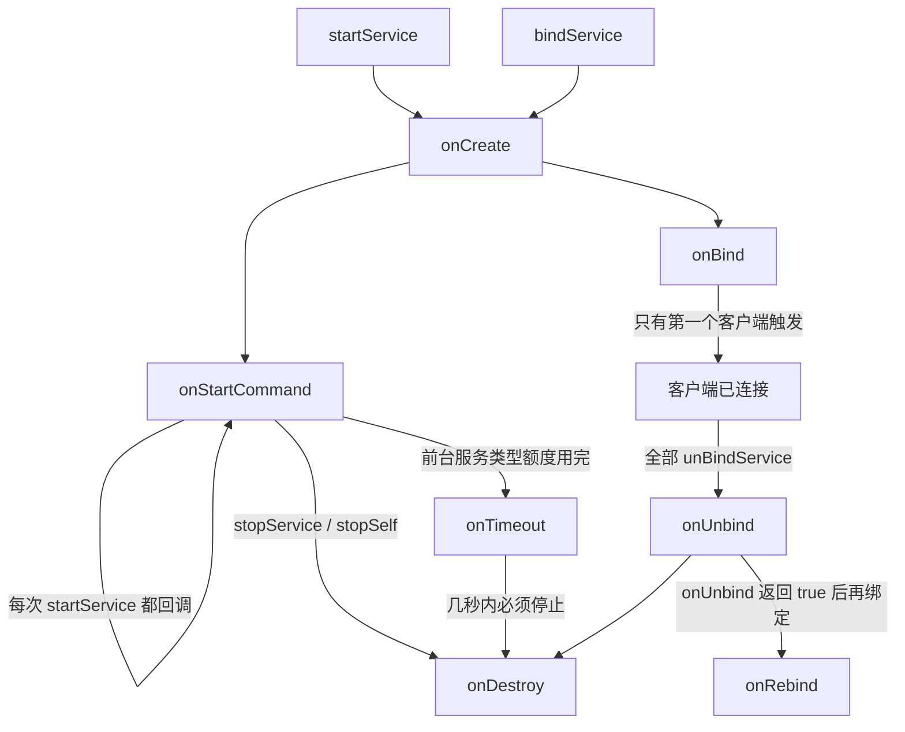

> Service 没有界面，它的生命周期完全由**启动方式**决定：`startService` 与 `bindService` 走两条不同的路径，
> 而且两条路径可以同时存在、互不抵消。启动方式的细节见 [[Service 启动方式]]。

## 1. 两条路径全景

`onCreate` 是两条路径共用的入口，**一个 Service 实例只走一次**。

## 2. 回调详解

### onCreate
- **调用次数**：实例创建时一次。无论 `startService` 调用多少次、有多少客户端绑定，都不会再回调
- 适合：初始化资源（注册监听、创建工作线程、初始化播放器）
- **别做**：耗时操作。它在主线程执行，直接拖慢 `startService` 的返回

### onStartCommand(Intent, flags, startId)
- **每次** `startService` / `startForegroundService` 都会回调一次 —— 这是和 `onCreate` 最容易混淆的地方
- `startId`：本次启动请求的唯一 id，用于 `stopSelf(startId)` 精确停止
- `flags`：常见 `START_FLAG_REDELIVERY`，表示这个 Intent 是系统重新投递的
- 返回值决定"进程被杀后是否重建"，必须显式返回：

| 返回值 | 被杀后行为 | 适用场景 |
| --- | --- | --- |
| `START_STICKY` | 重建服务并回调 `onStartCommand`，但 **Intent 为 null** | 不依赖启动参数的常驻服务（播放器、监听） |
| `START_NOT_STICKY` | 不重建，除非期间又有新的启动请求 | 任务型服务（跑完就结束） |
| `START_REDELIVER_INTENT` | 重建并**重新投递最后一个 Intent** | 需要参数才能继续的任务（下载） |
| `START_STICKY_COMPATIBILITY` | 兼容旧版本，不保证重建 | 基本不用 |

- 默认实现返回 `START_STICKY` / `START_STICKY_COMPATIBILITY`（随版本），所以**不要依赖默认值**
- 细节：返回 `START_REDELIVER_INTENT` 时不要调 `stopSelf()`，否则待重投递的 Intent 会被丢掉
- **它没有被废弃**：`onStartCommand` 至今仍是启动式服务的唯一入口（API 36 依然如此）。被废弃的是 `IntentService`（API 30，含 `onHandleIntent`）和更早的 `Service.onStart(Intent, int)`，后台任务应迁到 `WorkManager`

### onTimeout(int) / onTimeout(int, int)
- **新增回调**：`onTimeout(int startId)` 加入于 API 34（Android 14），`onTimeout(int startId, int fgsType)` 加入于 API 35（Android 15）
- 触发条件：带时限的**前台服务类型**额度用完 —— `shortService` 约 3 分钟，`dataSync` / `mediaProcessing` 是 24 小时滚动窗口内 6 小时
- 系统只留**几秒**宽限期，必须在这几秒内停掉服务（`stopSelf()` / `stopService()` / `stopForeground(int)` 都算），否则应用崩溃；`shortService` 超时未结束会 ANR
- API 34 以下不会有这个回调，所以不能只靠它兜底，自己也要保证按时停止
- 完整说明与代码见 [[Service 前台服务]]

### onBind(Intent)
- 只被**第一个**绑定的客户端触发；后续客户端复用同一个 `IBinder`，不再回调
- 只做启动式用途的服务可以直接用默认实现（返回 null）；但只要有客户端绑定，就必须返回有效 `IBinder`，否则客户端只会收到 `onNullBinding`（API 28+）拿不到服务对象
- 返回值就是 [[Service 启动方式]] 里说的本地 Binder / Messenger / [[AIDL]] 三类

### onUnbind(Intent)
- **所有**客户端都解绑时调用
- 返回 `true` 表示"下次再有客户端绑定时回调 `onRebind`"；返回 `false` 则下次直接走 `onBind`

### onRebind(Intent)
- 只在 `onUnbind` 返回过 `true`、且又有新客户端绑定时回调
- 用来恢复在 `onUnbind` 里释放掉的资源

### onDestroy
- 服务销毁前的最后一个回调，两条路径共用
- 适合：反注册监听、停止线程、释放播放器、保存必要数据
- **不保证被调用**：进程被系统杀死、用户强停应用时都不会走这里

## 3. 启动 / 停止的组合规则

| 操作 | 回调 | 说明 |
| --- | --- | --- |
| `startService`（首次） | `onCreate → onStartCommand` | |
| `startService`（再次） | `onStartCommand` | `onCreate` 不再调用 |
| `stopService` / `stopSelf` | `onDestroy` | 前提：没有客户端还绑着 |
| `bindService`（首个客户端） | `onCreate → onBind` | |
| `bindService`（后续客户端） | 无回调 | 直接用同一个 `IBinder` |
| `unbindService`（还有客户端） | 无回调 | 服务继续运行 |
| `unbindService`（最后一个） | `onUnbind → onDestroy` | 前提：没有被 `startService` 启动过 |

**销毁条件只有一条**：既没有任何客户端绑定，也不是被 `startService` 启动的。

混用时有两个必须记住的结论：

- 先 `startService` 再 `bindService`：`onCreate` 只走一次，`onStartCommand` 之后才会 `onBind`
- 只 `stopService` 停不掉"还有客户端绑定"的服务，只 `unbindService` 也停不掉"被 startService 启动"的服务 —— 两边条件都满足才会 `onDestroy`

## 4. 进程优先级：Service 对存活的影响

| 服务形态 | 进程重要性 | 被杀概率 |
| --- | --- | --- |
| 前台服务（`startForeground`） | 仅次于可见进程 | 低（内存极紧张时仍可能被杀） |
| 绑定服务（客户端在前台） | **不低于客户端** | 较低 |
| 启动式服务（`startService`） | 服务进程 | 中 |
| 纯后台（无任何活动组件） | 缓存进程 | 高 |

- 绑定服务"抬高优先级"是被动生效的：客户端可见，服务进程就跟着沾光
- 想主动提高优先级只有一条正路：[[Service 前台服务]]
- 观察：`adb shell dumpsys activity processes`

## 5. 线程模型与 ANR

- Service 的所有生命周期回调都跑在**主线程**（和 Activity 共用 UI 线程），默认**不做任何线程调度**
- 所以在 `onStartCommand` 里做网络 / 数据库 / 大文件操作，一样会 ANR
- Service 回调的 ANR 超时：前台服务约 **20 秒**，后台服务约 **200 秒**（比 Activity 的 5 秒宽松，但不是免死金牌）
- 正确做法：自己在 Service 里开线程 / 协程 / 线程池，或交给 `WorkManager`
- 历史方案 `IntentService` 内部自带 `HandlerThread` 串行处理、处理完自动 `stopSelf`，但**已废弃**（API 30 起）

## 6. 常见坑

1. **以为 `onCreate` 每次 `startService` 都会调用** —— 只有第一次
2. **以为 `onStartCommand` 只会调用一次** —— 每次启动请求都会调用
3. **`stopSelf()` 顺手停掉了刚进来的新任务** —— 应该用 `stopSelf(startId)`
4. **`START_REDELIVER_INTENT` 配 `stopSelf()`** —— 待重新投递的 Intent 会丢
5. **在服务回调里直接做耗时操作** —— 主线程，照样 ANR
6. **忘了 `unbindService`** —— `ServiceConnection` 泄漏 Activity（在 `onStop` 或 `onDestroy` 里解绑）
7. **用 `onDestroy` 保存关键数据** —— 进程被杀时不会执行
8. **用 `stopService` 停"绑定中的服务"** —— 停不掉，先确认没有客户端绑定
9. **靠 `START_STICKY` 做保活** —— 重建时 Intent 为 null，而且会被后台限制、Doze 反复压制，别把它当保活方案
10. **以为 `onStartCommand` 被废弃了** —— 没有。被废弃的是 `IntentService`（`onHandleIntent`），后台任务改用 `WorkManager`
11. **没实现 `onTimeout`** —— 前台服务类型额度用完后应用会崩（`shortService` 是 ANR），而宽限期只有几秒
